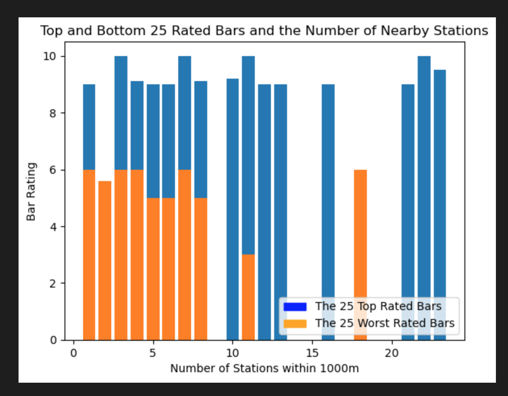

# Final-Project-Statistical-Modelling-with-Python

## Project/Goals
My goal is to to explore the City bike data from its API for the city of Montreal. In Montreal, the bikes fall under the name Bixi rather than City. My aim is to find out what if any relationship exists between a Bar's popularity/rating and its price against the number of bikes used, or percentage of bikes used, or the number of stations that are within 1000m of the bar.

## Process
### Step 1
I chose Montreal as my city of interest. Using the bixi stations latitiude and longitude as local points, I used an API request for Foursquare and Yelp respectively to find the data for bars that were within 1000m of the bixi stations.
I noticed that both API requests were picking up the same bar multiple times which means that there were more than 1 bixi station within 1000m of that bar. I made a column for it that after cleaning eventually became the number_stations_pinged column.
After cleaning and standardizing the data in both the Foursquare and Yelp dataframes,  combined both because with only one I had roughly 300 values, and the other roughly 200. After combining, I noticed that 39 bars that occurred in both. 
After combining them, I needed to fill in the vlaues which were missing in each. Yelp did not have a popularity score, and FOursquare didn'y have a reviews count. To fill these in I used Numpy to randomly generate appropriate values for thr NaNs between the max and min of this columns. 
### Step 2
Before I combined the two bar API calls into one dataframe for the modelling part of the project, there were some interesting differences between the two.
One of the most intersting things is that given the same API paramters (ie the bixi stations coordinates, and the same radius) the two API requests (in Montreal) found the same bars only 39 times. The fact that in hundreds of bars, they only overlapped 39 times is certainly something curious and maybe worth looking into in the future. The other interesting thing is the clientel differences. The Top 10 bars for each API was almost completely different. Not only was it different, but the Yelp ratings in the top 10 showed places that were less expensive than the those in the Foursquare data. This suggests that generally speaking, people on Yelp favour lower price as their deciding factor for a favourable rating, while Foursquare favourable ratings rely on other features That being said, the mean in both instances was still around 2.0 (which for price was on a categorical scale of 1.0, 2.0, 3.0, 4.0).

I also created a few new columns from the data provided. When I noticed that both API requests were picking up the same bar multiple times which means that there were more than 1 bixi station within 1000m of that bar. I made a column for it. In each bar dtataframe I called them total_counts, in the combined bar and bixi dataframe I renamed it num_stations_pinged. Aother column I added was a rough percentage used which was based on the number of empty slots compared to the total slots for that station. Each of thise columns were important for the later analysis.

Once everything was combined, I created and saved the bixi, cleaned foursqure, and cleaned yelp dataframes using SQLite. Then  did some visualizationsm but it was difficult to properly undertsand what was going on. I then set out to do my modeling.  

## Results

Before getting confirmation from the statistical models, the visualizations I made do also support my hypothesis that the number of bike stations within 1000m of a bar positively affect its rating: .

Model 1: The Rating and Percent Used:
- R-squared: R-squared reflects the fit of the model. R-squared values range from 0 to 1, where a higher value generally indicates a better fit, assuming certain conditions are met. In this output, we can see that the value is 0.571. This means that the model is capable of explaining 57.1% of the patterns in the data. It does make sense that bars that have a more public transit options to get to them would have more of an opportunity for patrongage and therefore would have a higher rating. Also, more bike stations within 1000m suggests that the bar is more centrally located within the city and therefore would have more tourists and people looking for a good time which lends itself well to a higher rating. 

- P>|t| (or the p-value): A p-value of less than 0.05 is considered to be statistically significant. This regression output shows a p-value of 0, which means that the probability of the relationship between the number of stations within 1000m of a bar and the bar's rating being solely due to natural variation is 0. In other words, the number of nearby bike stations does impact the rating of a bar.

- coef: Coef is short for the coefficient of the independent variable. It represents the impact on the response variable per unit increase of the independent variable. In this case, we can see that the coef of num_statations_pinged has a value of 0.7047. This means that a unit increase in the value of num_stations_pinged will have a positive impact on the rating of a bar.

Model 2:
- I made a model for the relationship between popularity and rating because I wanted to be sure that they had strong positive relationship. I also think this is a strong relationship for bars to be able to know. Popularity is a deeply human and subjective criteria, but rating (which really is their online rating) is much more concrete. The model's p-value (0.00) shows a statistically significant relationship between rating and popularity. The rating can account for 82.8% of the popularity rating of the bars considered in this model. Unsurprisingly, the positive coefficient means that as a bar's rating increases so too does the bar's popularity. 

- Based on the R^2 value of my simple linear regression model, for how popularity of a bar within 1000m radius of bixi station efffects the percentage of bikes used (or how busy the station is) shows that the bar's popularity has a statistically significant effect on the business of the bike station and can account of about 73% of the percentage of used bikes at the given station.
Unsurprisingly, bars tend to be in high foot-traffic areas and tourist spots, and the nightlife in Montreal is pretty good so it does make sense that it would have a significant affect on the usage of bixi bikes.

Model 3:
- Based on this Adj R^2 value, my multi-linear model looking at Bar Ratings in Montreal conveys that popularity, the number of reviews, the price, the number of nearby bixi stations, and the busynesses of those stations has a statistically significant relevance for 9%-10% of rating of a bar in Montreal.

- I chose to include the popularity column even though it's p-value is greater than 0.05 because it is important, but also it's a very human and subjective value and so to have it so close to the desired p-value threshold I think is important.

- From the bixi API, it is really interesting to see that the availability of affordable, nearby public-transit access is the most statistically significant element.

- Also, at least in this model, the price and the business of the bixi_stations nearby appear to hahve a similar affect. That would be a place to explore further. A future look could be a deeper dive into the availability of public transit and the ratings of bars. 

- Since people can't drink and drive, it seems like the availability to get to or from a certain bar would have an effect on it's popularity/rating.

## Challenges 
One of the major challenges I faced was that I was not aware of the API request limit for Yelp and then hit it. I lost a lot of time because of that. I learned that it is something to be very aware of when approaching a time-sensitive project. Also, there was the interesting problem of trying to coalesce the data when trying to combine them since each API had a different kind of metrics available in their API requests.

## Future Goals
If there was more time, I would also try and separately join each of the Yelp API and Foursquare API to the bixi station dataframe because I think there is an interesting avenue to explore there as to the differences in their clientel. I would like to expand the included venues to include restaurants since I think that will have a much larger venue pool to draw from. 
